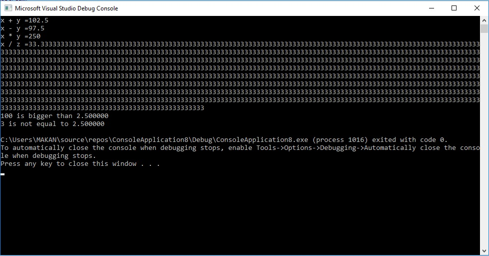

BigNumbers
===========
It is a class that is useful for dealing with realy big numbers. We can define numbers as integer or fractional with thausands of digits and do math operations same as basic variables.

## Credits

This repo is compiled by [Makan Edrisi](https://github.com/makannew)

## Table of content
- [Class members]
- [Documentation]
- [How to use with example](https://github.com/makannew/Big-Numbers/blob/master/README.md#how-to-use)

##Documentation
Class members implementation documented by Doxygen. It is available [here](https://makannew.github.io/Big-Numbers/)

## How to use
By adding "BigNumber.h" and "BigNumber.cpp" to a project we can define BigNumber variables like regular int or double variables.
The example below shows how it works:
```
#include "stdafx.h"
#include <iostream>
#include "BigNumber.h"

using namespace System;

int main()
{
	BigNumber x,y,z;
	x = "100"; //set number by string
	y = 2.5; //set number by double
	std::cout << "x + y =" << x + y << std::endl; //add method
	std::cout << "x - y =" << x - y << std::endl; //sub method
	std::cout << "x * y =" << x * y << std::endl; //mul method

	z = 3; //set by intiger
	x.max_div_digits = 1000; //continue dividing up to 1000 decimal digits
	std::cout << "x / z =" << x / z << std::endl; //div method

	if (x > y) std::cout << x << " is bigger than " << y << std::endl; //comparing operator
	if (z != y) std::cout << z << " is not equal to " << y << std::endl; 

    return 0;
}
```

